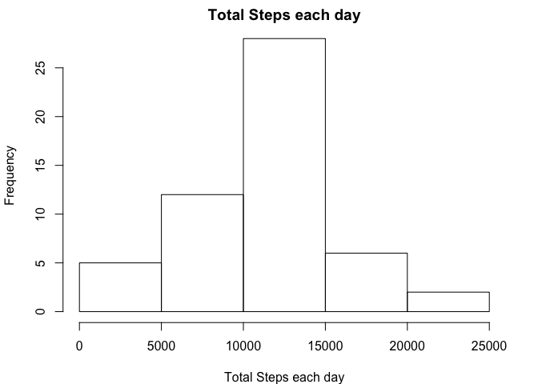
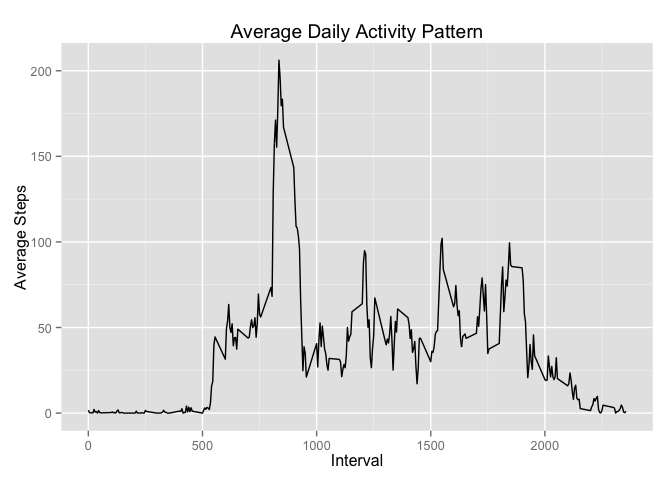
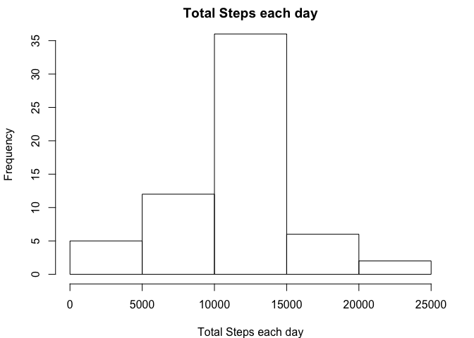
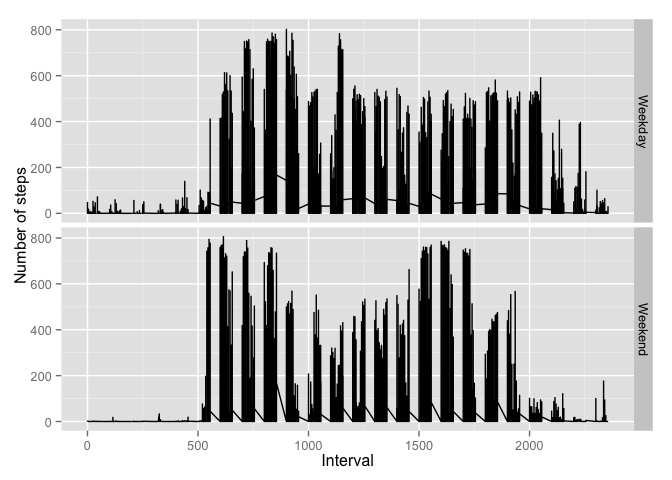

# Reproducible Research: Peer Assessment 1

```r
library(dplyr)
```

```
## 
## Attaching package: 'dplyr'
## 
## The following object is masked from 'package:stats':
## 
##     filter
## 
## The following objects are masked from 'package:base':
## 
##     intersect, setdiff, setequal, union
```

```r
library(ggplot2)
```

## Loading and preprocessing the data
reading downloaded file

```r
data <- read.csv("activity.csv", sep=",")
```


## What is mean total number of steps taken per day?
Ignore the missing values in dataset

```r
naremoved <- complete.cases(data)
dataset <-data[naremoved,]
```
1. Calculate the total number of steps taken per day
  


```r
#Group the data for each day
groupdata <- group_by(dataset, date)
#create the dataset with each day and the sum of steps
tableofsum <- summarize(groupdata, sum= sum(steps), mean= mean(steps), median= median(steps))
```
2. Make a histogram of the total number of steps taken each day


```r
par(mar= c(4, 4.1,1.8, 2.1))
hist(tableofsum$sum, xlab= "Total Steps each day", main= "Total Steps each day", labels= FALSE)
```

 

Calculate the mean and median of the total number of steps taken per day

```r
mean= mean(tableofsum$sum)
mean1= signif(mean, digits= 7)
median= median(tableofsum$sum)
```
Mean of total number of steps taken per day = 1.0766189\times 10^{4}

Median of total number of steps taken per day = 10765


## What is the average daily activity pattern?

```r
#extracting data by interval by excluding dates
intervalPreSet <- dataset[,-2]
#grouping cleaned data set by interval
intervalset <- group_by(intervalPreSet, interval)
#summarizing grouped data for intervalset
summarizedset <- summarize(intervalset , sum= sum(steps), mean= mean(steps), median= median(steps))
#line plot using ggplot
g <- ggplot(summarizedset , aes(x=summarizedset$interval,y= summarizedset$mean))
g+ geom_line() + 
    labs(x="Interval", y="Average Steps", title="Average Daily Activity Pattern")
```

 
Calculating 5-minute interval, on average across all the days in the dataset, contains the maximum number of steps

```r
maxintervalval4maxmean <- summarizedset$interval[ summarizedset$mean == max(summarizedset$mean)]
```
5-minute interval, on average across all the days in the dataset, containing the maximum number of steps is 835


## Imputing missing values

1. Calculate and report the total number of missing values in the dataset (i.e. the total number of rows with NAs)

```r
#reading NA rows from original dataset and counting rows
output <- data[is.na(data),]
totalrows <- nrow(output)
```
The total number of missing values in the dataset is 2304

2. Missing NA at each interval is filled with that interval's mean value
3. Creating new dataset


```r
#creating a copy of original data so that NAs can be filled
data_copy <- data

#filling the NAs and creating new data set
for (idx in summarizedset$interval)
{
    data_copy$steps[(is.na(data_copy$steps))& (data_copy$interval == idx) ] = summarizedset$mean[ summarizedset$interval == idx ]
}
```

4. Histogram for total number of steps each day for new dataset that has NAs filled in

```r
#Group the data for each day
groupeddata <- group_by(data_copy, date)
#create the dataset with each day and the sum of steps
newdata <- summarize(groupeddata, sum= sum(steps))
```
2. Make a histogram of the total number of steps taken each day


```r
par(mar= c(4, 4.1,1.8, 2.1))
hist(newdata$sum, xlab= "Total Steps each day", main= "Total Steps each day", labels= FALSE)
```

 

## Are there differences in activity patterns between weekdays and weekends?
1. Create  a new factor variable in the dataset with two levels – “weekday” and “weekend” indicating whether a given date is a weekday or weekend day.

```r
#identifying the weekdays
data_copy$week <- weekdays(as.Date(data_copy$date), abbreviate = TRUE)
#creating levels as Weekday and Weekend
weekday <- c("Mon","Tue","Wed","Thu","Fri","Sat","Sun")
data_copy$weekday <- as.factor(ifelse(data_copy$week %in% c("Mon","Tue","Wed","Thu","Fri"), "Weekday", "Weekend"))
```

```r
weekday <- data_copy$weekday
qplot(data_copy$interval, data_copy$steps, data= data_copy, geom="line", facets= weekday ~., xlab= "Interval", ylab= "Number of steps")
```

 


